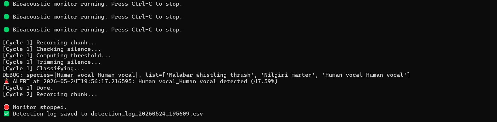
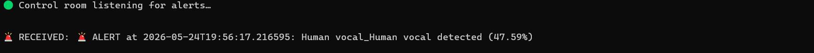

# Bioacoustic Sentinel

A real-time, networked bioacoustic monitoring system. A field sensor captures live audio, classifies bird species using **BirdNet**, and transmits alerts over a local network socket to a control‑room receiver if the classified species is endangered. This was built in 24 hours during **Multi Species Hackathon** conducted in Kochi, Kerala, India.

## System Architecture

```
[Microphone] → [Bioacoustic Monitor] → [Socket] → [Control Room]
(sensor) (alert) (receiver)
```

- **Bioacoustic Monitor (`bioacoustic_monitor.py`)** – Captures 4‑second audio chunks, applies an adaptive silence gate, trims quiet edges, classifies species with BirdNet, and sends alerts for endangered species.
- **Control Room (`control_room.py`)** – Listens on a local TCP socket and displays received alerts in real time, simulating a ranger station.

## What It Does

- Captures live audio from a USB microphone in 4‑second chunks at 16 kHz mono.
- Calibrates an **adaptive silence threshold** against the ambient noise floor to avoid false triggers.
- Trims leading and trailing silence for clean classifier input.
- Classifies species using the BirdNet analyzer with confidence scoring.
- Alert system is triggered when the detected species is classified as **endangered species** (this is a configurable list and as a default it has "Malabar whistling thrush" and "Nilgiri marten").
- Transmits alerts in real time over a TCP socket to a companion receiver.
- Logs all detections (species, confidence, cycle) to a timestamped CSV file.

## Sample Output

**Sensor Output (Bioacoustic Monitor):**



**Receiver Output (Control Room):**



## Problems Encountered and Resolved

| Finding | Description | Resolution |
|---|---|---|
| F‑01 | Silence gate threshold too strict for indoor testing | Adaptive background RMS tracking with configurable offset |
| F‑02 | BirdNet expects 48 kHz audio; capture records at 16 kHz | Librosa resampling before classification |
| F‑03 | BirdNet species label didn't match `ENDANGERED_SPECIES` entry (hidden whitespace / naming differences) | Diagnosed by printing the exact species key; documented that labels must be copied exactly from the model's `species_list` |
| F‑04 | Virtual environment was lost after switching machines | Recreated venv, documented exact dependencies in `requirements.txt` |
| F‑05 | Intermittent hang during BirdNet inference (TensorFlow Lite XNNPACK delegate, running inside the full `tensorflow` package) on Windows | Mitigated by restarting monitor; future work: migrate to LiteRT or add timeout |
| F‑06 | UnicodeEncodeError when writing alert emoji to log file on Windows | Set `encoding="utf-8"` when opening `alerts.log` |
| F‑07 | No hardware to display alerts in real time at the hackathon | Built companion control‑room receiver that listens on a socket and displays alerts |

## Setup and Usage

### Requirements
- Python 3.9+
- A working USB microphone
- Two terminal windows (for the full system demo)

### Installation

```bash
git clone https://github.com/sssivasiddharth/bioacoustic-sentinel.git
cd bioacoustic-sentinel
pip install -r requirements.txt
```

## Running the Full System

- **Start the Control Room (receiver):**

```bash
python control_room.py
```

You should see 🟢 Control room listening for alerts….

- **Start the Bioacoustic Monitor (sensor) in a second terminal:**

```bash
python bioacoustic_monitor.py
```

The monitor will calibrate the silence gate and begin listening. Speak (yes, it won't throw an error when humans speak) or play bird sounds. If an endangered species is detected with confidence ≥ ALERT_CONFIDENCE, an alert will appear in the control‑room terminal.
- Press Ctrl+C in each terminal to stop. The detection log is saved as a timestamped CSV file.

## What This Project Taught Me – The Cathedral

This project has taught me a lot like real-time audio pipelines, adaptive threshold calibration, networked alerting, and honest failure documentation (though I did not mention the single misplaced emoji that brought down the logging system in Windows). I believe that these skills would be directly transferred to my next project: AR Glass subtitle engine as well as my larger vision: a fully immersive, non-invasive brain-computer interface. From using the universal character encoding for the emoji inclusion to adding and calibrating the silence gate, every one of these bricks is taking a step closer towards building the cathedral.

## License

MIT


